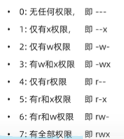

**su [-] root**

>change to root

>[-] if add environment variey

**sudo +command**

>/etc/sudoers 

> ADD pch ALL=(ALL) NOPASSWD:ALL

**groupadd $groupname**

**groupdel $groupname**

**useradd [-g -d] $username**-> adduser

>-g to which group 

>-d user's home path

**userdel [-r]  $username**  

>-r del home folder

**id $username**

usermod -aG $group $username

**getent passwd**

>find all user

**getent group**

>find all group

**ls -l**

>permission user usergroup

**permission:**

> \- file

>d  folder

>i  softlink

**user permission+ usergroup permission+else**

r:read;w:write;x:excute  (move work file to this folder)

**chmod [-R]  permission file&folder**

>-R  not just folder

>permission u=**; g=* ;o=*

**r=4;w=2;x=1**

**chrown [-R] user&user group  file&folder**

**ctrl+r** search history

